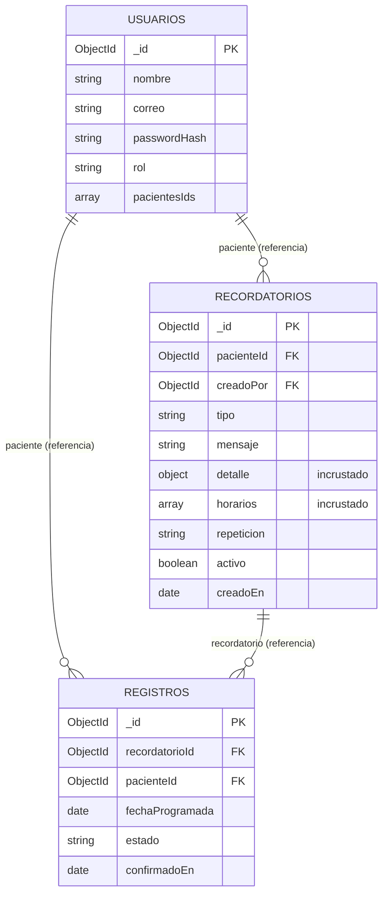

# Diagrama del modelo documental (versión 1)

```mermaid
erDiagram
    USUARIOS ||--o{ RECORDATORIOS : "paciente (referencia)"
    USUARIOS ||--o{ REGISTROS : "paciente (referencia)"
    RECORDATORIOS ||--o{ REGISTROS : "recordatorio (referencia)"

    USUARIOS {
        ObjectId _id PK
        string nombre
        string correo
        string passwordHash
        string rol
        array pacientesIds
    }

    RECORDATORIOS {
        ObjectId _id PK
        ObjectId pacienteId FK
        ObjectId creadoPor FK
        string tipo
        string mensaje
        object detalle "incrustado"
        array horarios "incrustado"
        string repeticion
        boolean activo
        date creadoEn
    }

    REGISTROS {
        ObjectId _id PK
        ObjectId recordatorioId FK
        ObjectId pacienteId FK
        date fechaProgramada
        string estado
        date confirmadoEn
    }
```
